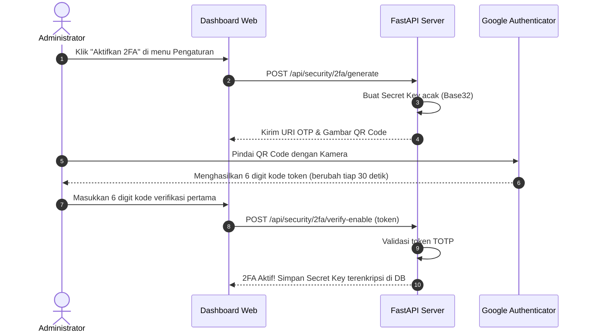

# 🔐 Roadmap Keamanan & Otentikasi 2FA (Google Authenticator / TOTP)

Dokumen ini memuat spesifikasi dan rencana implementasi arsitektur keamanan tingkat lanjut untuk **NawalaSentinel** saat dipublikasikan ke server produksi (seperti aaPanel / VPS Linux).

---

## 1. Arsitektur Otentikasi Google Authenticator (TOTP)

### Komponen Teknis yang Akan Digunakan:
- **`pyotp`**: Library Python standar industri untuk pembangkitan Time-based One-Time Password (RFC 6238).
- **`qrcode`**: Library pembuat visualisasi barcode QR untuk dipindai oleh aplikasi Google Authenticator di smartphone pengguna.

### Alur Kerja (Workflow):



---

## 2. Fitur Proteksi Tingkat Tinggi yang Direncanakan

1. **Proteksi Khusus Tombol Update Website & aaPanel**:
   - Setiap kali tombol **"Perbarui Website dari GitHub"** diklik, modal verifikasi akan muncul meminta:
     1. Password Akun Administrator.
     2. 6-digit kode OTP dari Google Authenticator.
   - Tanpa validasi kedua faktor ini, pipeline `git pull` dan `init_db()` tidak dapat dieksekusi.

2. **Proteksi Pengaturan Sensitif**:
   - Perubahan Token Bot Telegram, Chat ID, dan Konfigurasi Proxy Operator diwajibkan melewati verifikasi OTP.

3. **Session Re-Authentication & Rate Limiting**:
   - Jika terjadi 5x kegagalan input OTP berturut-turut, sistem otomatis mengunci aksi selama 15 menit untuk menangkal serangan *brute-force*.

---

## 3. Panduan Deploy aaPanel (Zero-Downtime Service Reload)

Saat website berjalan di aaPanel:
1. **Gunakan Python Manager / Supervisor**:
   - Kelola proses `main.py` menggunakan daemon **Supervisor** pada menu aaPanel -> *App Store* -> *Supervisor Manager*.
   - Konfigurasi Command:
     ```bash
     /www/server/pyporject_evn/your_env/bin/python main.py
     ```
2. **Perintah Reload yang Aman**:
   - Supervisor secara otomatis dapat me-restart proses dalam 1-2 detik jika terjadi sinyal exit atau reload:
     ```bash
     supervisorctl restart nawalasentinel
     ```
   - Tombol pembaruan di dashboard secara otomatis menangani pembaruan file dan sinkronisasi skema database.
